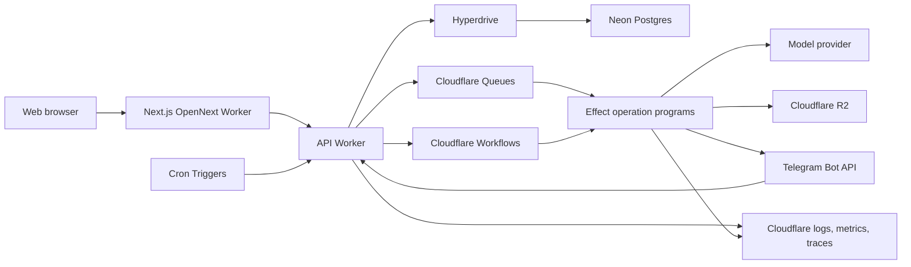

# Xpensego — Technical Specification v4.4

**Status:** Active implementation baseline
**Updated:** 31 July 2026
**Product authority:** [Product Document](./xpensego-product-doc.md)
**Behavioral authority:** [PRD](./PRD.md)
**Domain language:** [Domain Context](./CONTEXT.md)

This document owns architecture, module boundaries, data and reliability invariants, contracts, topology, and technical verification. It does not redefine product scope, user-facing requirements, or delivery sequencing.

## 1. Mission and scope

Build the technical foundation for the PRD's **[CORE]** behavior and a channel seam that can later support **[WHATSAPP]** without rewriting domain modules. Product sequencing remains in the [Product Document](./xpensego-product-doc.md#11-success-gates), and implementation order remains in the [Delivery Checklist](./CHECKLIST.md).

The existing Python bot, SQLite database, and Cloudflare Worker are hackathon artifacts. They may supply fixtures and lessons, but the new system does not reuse their application architecture or claim feature completion from their tests. Choosing Cloudflare for the replacement platform does not make the legacy Worker a production foundation. **[POST-SIGNAL]** behavior is outside this specification.

## 2. Locked decisions

1. **TypeScript end to end.** Application code uses a TypeScript monorepo.
2. **Next.js on Cloudflare Workers.** Next.js App Router provides the user-facing web surface and is deployed through the Cloudflare OpenNext adapter.
3. **Effect application runtime.** Backend use cases are Effect programs. Cloudflare Worker entrypoints provide dependencies, execute programs, and translate typed outcomes to transport responses. NestJS is not used.
4. **Cloudflare production platform.** Workers provide compute; Queues provide asynchronous delivery; Workflows provide durable multi-step execution; Cron Triggers initiate schedules; R2 stores controlled objects; Cloudflare secrets and observability support runtime operations.
5. **Neon PostgreSQL authority.** Neon is the managed PostgreSQL provider and system of record for users, ledgers, transactions, imports, consent, delivery, audit, and usage. Workers reach application traffic through cache-disabled Hyperdrive configurations. Application adapters use Effect SQL with `@effect/sql-pg` and its `pg` backend; schema changes use Effect SQL's forward-only migrator through a separate direct administrative connection, as recorded in [ADR 0003](./docs/adr/0003-effect-sql-postgres-migrations.md).
6. **Shared messaging seam.** Telegram is the first adapter; later WhatsApp behavior reuses the same domain interfaces. The Product Document owns its release gate.
7. **One product across surfaces.** Web and messaging surfaces use the same users, ledgers, domain rules, and audit history.
8. **Asynchronous external work.** Imports, model work, exports, deletion, and notifications use Queues or Workflows rather than long-lived webhook requests.
9. **Structured model operations.** Models receive narrow tools and cannot choose identity scope, write database queries, or bypass domain invariants.
10. **Production behavior is evaluated end to end.** Handler-only tests cannot satisfy a release gate.
11. **No speculative microservices.** Web and backend are separate deployments, but domain behavior remains a modular monolith. Queue consumers or Workflows split into additional Workers only for an evidenced isolation or scaling need.
12. **External-data readiness is evidenced.** Production recovery and capacity follow the accepted [Cloudflare/Effect](./docs/adr/0001-cloudflare-workers-effect-backend.md) and [Neon](./docs/adr/0002-neon-postgres.md) decisions and must pass the Checklist's invite-readiness evidence.

Open selections and their blocking phase are listed once in §19.

Before a capability is scaffolded and again before it is released, its owning checklist phase revalidates current official documentation for [OpenNext on Workers](https://developers.cloudflare.com/workers/framework-guides/web-apps/nextjs/), [Hyperdrive and Neon](https://developers.cloudflare.com/hyperdrive/examples/connect-to-postgres/postgres-database-providers/neon/), [Hyperdrive query caching](https://developers.cloudflare.com/hyperdrive/concepts/query-caching/), [Queues](https://developers.cloudflare.com/queues/reference/delivery-guarantees/), [Workflows](https://developers.cloudflare.com/workflows/), [R2](https://developers.cloudflare.com/r2/), [Effect](https://effect.website/docs/), and [Neon](https://neon.com/docs/introduction/scale-to-zero). Runtime compatibility, limits, retention, and pricing are release inputs rather than permanent facts copied into this specification.

## 3. System context



When WhatsApp is added, it connects to the same channel ingress and notification seams. It does not receive a separate ledger or agent implementation.

## 4. Repository structure

Target layout:

```text
apps/
  web/                         # Next.js App Router deployed through OpenNext
  api/                         # Cloudflare Worker HTTP, channel, queue, cron and Workflow entrypoints
packages/
  domain/                      # Effect services, use cases, domain schemas and typed errors
  adapters/                    # PostgreSQL, Telegram, model, R2 and Cloudflare binding adapters
  contracts/                   # versioned transport schemas, OpenAPI and generated clients
  config/                      # shared lint, TypeScript, environment validation
  testing/                     # fixtures, builders, evaluation corpus and helpers
docs/
  adr/                         # added only for durable, non-obvious trade-offs
legacy/
  hackathon-python/            # moved only after replacement behavior exists
  hackathon-worker/
CONTEXT.md
PRD.md
SPEC.md
CHECKLIST.md
```

The initial change may introduce `apps/` and `packages/` without immediately moving hackathon files. Moving legacy code is a later, explicit cleanup after data and behavior audits.

## 5. Architectural rules

### 5.1 The Effect backend is authoritative

- Domain behavior lives in Effect services and use-case programs under shared backend packages.
- Worker entrypoints remain thin: decode untrusted input, resolve a trusted `ActorContext`, provide the invocation Layer graph, execute one application program, and map its typed result.
- Next.js never connects directly to PostgreSQL.
- Next.js Route Handlers and Server Actions are limited to web-session or backend-for-frontend concerns that cannot be handled cleanly by calling the API Worker.
- Route Handlers must not duplicate domain validation, authorization, or transaction logic.
- Telegram and future WhatsApp adapters call the same application-facing module interfaces used by web requests after identity resolution.
- Backend code must not assume a long-running Node.js server, writable local filesystem, process-local scheduler, or in-memory durable state.
- Cloudflare bindings are exposed through adapter interfaces rather than imported into domain modules.

### 5.2 Effect conventions

- Untrusted HTTP, queue, Workflow, provider, and configuration values are decoded at their seam with versioned schemas. Internal contracts reject unknown fields; third-party webhooks validate the required supported subset and tolerate additive provider fields.
- Domain invariants remain explicit domain code; successful schema decoding alone does not authorize an operation.
- `Context` services and `Layer` composition define dependencies and resource lifecycles. The same dependency must not also be represented by a second service-locator or dependency-injection system.
- Expected failures use typed error families such as validation, authorization, not-found, conflict, rate-limit, and transient-provider errors. Defects are logged and surfaced as safe internal failures.
- HTTP, queue, and Workflow entrypoints own error-to-status, attempt-level retry, acknowledgement, and telemetry mapping.
- Secrets and sensitive configuration use Effect configuration and redacted values backed by Cloudflare secret bindings. Secret values never appear in logs or error serialization.
- Retries, timeouts, and concurrency limits are explicit and apply only to classified transient work. Validation, authorization, conflict, invariant, and ambiguous external-outcome failures are not retried blindly.
- A cached Effect runtime may contain only pure or stateless modules, validated static configuration, and factories for invocation-scoped adapters. `ActorContext`, correlation data, request values, mutable state, database clients, and scoped resources are constructed and finalized inside each `fetch`, `queue`, scheduled, or Workflow invocation and are never retained globally.
- `Effect.runPromise` or equivalent execution is confined to entrypoint adapters. Domain and application modules return Effect values.
- Effect retry is not durable execution. Work that must survive Worker termination is represented in PostgreSQL and dispatched through Queues or Workflows.
- Tests provide deterministic Layers for time, identifiers, repositories, channels, models, storage, queues, and telemetry.

### 5.3 Deep-module design

Each domain module presents one small interface to callers and hides persistence, validation, and audit details in its implementation. Callers and tests use the same interface. Modules return typed transient, terminal, and ambiguous-outcome failures; entrypoint orchestration owns re-execution, while an external adapter may perform only a documented bounded retry inside one attempt.

Adapters exist only at seams where behavior genuinely varies:

- production authentication and channel proofs versus deterministic test adapters;
- Telegram versus later WhatsApp ingress and rendering;
- production model provider versus deterministic test adapter;
- production storage and asynchronous delivery versus test adapters.

Do not add pass-through modules that merely rename repository calls.

### 5.4 Data ownership

- A trusted entrypoint resolves verified web or channel proof into an `ActorContext` containing the initiating user, authorized ledger, authentication strength, optional channel identity, and correlation identifier.
- `ActorContext` is constructed by the Identity module from server-held relationships. Clients, webhook text, queue payloads, and models cannot construct or override it.
- A `ChannelIdentity` resolves to a user before a ledger operation runs; link-challenge handling is the only pre-link flow.
- Ledger scope is derived once on the server and passed through `ActorContext`.
- Client payloads and model tools never supply authoritative user or ledger scope.
- Every transaction mutation has one initiating user and, where applicable, one channel identity.

### 5.5 Financial correctness

- Monetary values use a positive integer minor-unit amount stored as PostgreSQL `BIGINT`; floating-point, signed-amount, and dual debit/credit-column representations are prohibited.
- Every value carries an ISO 4217 currency code even while the beta supports INR only. Currency conversion is outside core scope.
- Direction is an explicit `debit | credit` value, and database constraints require a positive amount and supported currency.
- Spending and budgets use live debits unless an operation explicitly requests another calculation.
- Timezone-sensitive periods use the user's configured timezone.

## 6. Core modules and interfaces

Names below describe module responsibilities, not required class names.

### 6.1 Identity module

**Interface:** resolve a verified web principal or channel identity into `ActorContext`; link and unlink channel identities through one-use challenges.

**Invariants:**

- one channel identity belongs to at most one user;
- link challenges are high-entropy, stored only as hashes, rate-limited, short-lived, and consumed atomically;
- link challenges received from unsupported group contexts are rejected;
- destructive account operations require recent web authentication;
- resolving a channel event never trusts a user identifier from message text.

### 6.2 Ledger module

**Interface:** create, retrieve, search, correct, soft-delete, and restore transactions within the ledger in `ActorContext`.

**Invariants:**

- all reads and writes are ledger-scoped;
- retryable web mutations carry an actor- and operation-scoped idempotency key;
- source records remain immutable;
- corrections preserve prior values in an audit event;
- soft-deleted transactions are absent from normal queries, budgets, and alerts;
- permanent deletion is a separate orchestrated lifecycle.

### 6.3 Import module

**Interface:** accept an import, expose progress, and apply user decisions to its review items.

**Invariants:**

- an import has one stable idempotency key;
- source records are preserved before normalization;
- unsupported and low-confidence records remain visible;
- duplicates require an explicit policy or user decision;
- valid rows can complete even when other rows fail;
- terminal status is durable.

The implementation may use deterministic parsing, model extraction, or both. Callers do not select internal parsing stages.

### 6.4 Categorization module

**Interface:** suggest a category, apply user categorization rules, and maintain those rules after explicit corrections.

**Invariants:**

- an active user rule precedes a general suggestion;
- rules are user-scoped;
- every result identifies whether it came from a rule, deterministic mapping, or model;
- category identifiers are stable;
- confidence and version information are recorded.

### 6.5 Query module

**Interface:** answer a supported ledger question using a structured query request.

**Invariants:**

- callers cannot supply executable database syntax;
- ledger scope is injected;
- requested dates and calculation type are explicit in the result;
- unsupported questions fail honestly;
- results are deterministic for a fixed ledger snapshot and query request.

### 6.6 Budget module

**Interface:** manage monthly category budgets and calculate their status.

**Invariants:**

- usage counts live debits;
- period boundaries use the user's timezone;
- category and ledger scope are validated;
- a budget calculation has no notification side effect.

### 6.7 Notification module

**Interface:** select an eligible notification, persist its semantic outbound intent, and attempt that intent through a channel adapter.

**Invariants:**

- consent, channel preference, privacy mode, and the proactive-notification kill switch are checked at selection and again immediately before a provider attempt;
- selection, attempt, `provider_accepted`, delivered, read, suppressed, `outcome_unknown`, and failed are distinct states;
- idempotency prevents duplicate threshold alerts;
- only classified transient failures retain retry eligibility; blocked, invalid-recipient, consent-revoked, and ambiguous outcomes do not retry blindly;
- detailed financial previews follow the user's privacy preference;
- channel-specific rules do not leak into budget or ledger modules.

### 6.8 Conversation module

**Interface:** accept a normalized message plus `ActorContext`, interpret a supported intent, invoke authorized domain interfaces, and return a semantic response intent.

**Invariants:**

- the model never selects the user or ledger;
- model iterations, input size, tool calls, and cost are bounded;
- tool execution is audited;
- sensitive contents are not copied into general logs;
- any retained conversational context is minimal, bounded, and covered by the data-retention policy; persistent conversation history is not required by core;
- the interface works without a production model through a deterministic test adapter.

### 6.9 Analytics module

**Interface:** record approved product, quality, cost, and delivery events without financial contents.

**Invariants:**

- analytics payloads use internal identifiers and enumerated properties;
- transaction descriptions, source records, and user-written messages are excluded;
- events are versioned;
- critical operational records do not depend on a third-party analytics provider.

### 6.10 Data-rights module

**Interface:** request and complete export or permanent deletion.

**Invariants:**

- destructive requests require recent authentication and server-side confirmation;
- export and deletion requests are idempotent and own their user-visible progress;
- finished exports expire;
- deletion covers database records, stored objects, provider-held data where applicable, and the application's durable operation payloads;
- already-published Queue envelopes contain opaque operation identifiers only, become harmless after deletion, and expire under the documented platform-retention policy rather than being represented as immediately erasable;
- completion retains only the minimum non-financial audit evidence required to prove the lifecycle ran.

### 6.11 Operational-controls module

**Interface:** read and change independent kill switches for model work and proactive notifications.

**Invariants:**

- changes require authorized operator identity and create a content-minimized audit event;
- entrypoints check the applicable switch before accepting expensive work, and consumers check again immediately before model or notification provider calls;
- the disabled state is safe under dependency failure;
- a measured propagation objective and a staged exercise are required before external-user invite readiness passes.

## 7. Channel seam

Platform payloads, identifiers, media handles, templates, and rendering rules remain inside channel adapters. The adapter verifies the platform credential, persists and deduplicates the external event, resolves `ActorContext`, and submits a normalized command. An unlinked challenge is routed only to the Identity module.

External media is fetched asynchronously after webhook acknowledgement. The channel-media adapter validates size and content, computes a checksum, stores an accepted object in private R2, and creates PostgreSQL ownership metadata. Domain modules receive only internal attachment references; they never retrieve a Telegram or WhatsApp media identifier.

Minimum application-facing inbound contract:

```ts
type InternalAttachmentRef = {
  attachmentId: string;
  storedObjectId: string;
  mediaType: string;
  sizeBytes: number;
  checksum: string;
};

type InboundChannelCommand = {
  internalEventId: string;
  channel: "telegram" | "whatsapp";
  actor: ActorContext;
  occurredAt: string;
  text?: string;
  attachments: ReadonlyArray<InternalAttachmentRef>;
};
```

Domain modules emit a semantic intent rather than channel-ready text. `content` is a versioned discriminated union whose parameters are validated for its `kind`; the channel adapter owns localization, privacy-safe preview rendering, Telegram buttons, and later WhatsApp free-form or approved-template rendering.

```ts
type OutboundChannelIntent = {
  operationId: string;
  channelIdentityId: string;
  purpose: "reply" | "budget-alert" | "import-status" | "system";
  privacy: "detailed" | "private";
  content: {
    kind: string;
    version: number;
    parameters: Record<string, unknown>;
  };
  actions: ReadonlyArray<{ kind: "open-web"; path: string }>;
  correlationId: string;
};
```

These types do not authorize work independently. `ActorContext` is created from verified server-held identity relationships, and every receiving module still enforces its own invariants.

### Telegram adapter

The first implementation must:

- verify the configured Telegram webhook secret;
- decode the required supported subset, tolerate additive Telegram fields, and reject oversized or unsupported content;
- persist and deduplicate `update_id` through a unique database constraint;
- write the inbound event and a dispatch outbox record in one PostgreSQL transaction;
- publish the dispatch to Cloudflare Queues after commit, with a scheduled recovery path for unpublished outbox records;
- reject unsupported group-chat operations;
- normalize text messages and asynchronously convert accepted documents into internal attachment references;
- acknowledge the webhook before slow work;
- enqueue imports and model work through idempotent Queue messages;
- render semantic intents as concise responses and web deep links;
- record request outcomes as `provider_accepted`, terminal failure, transient failure, or `outcome_unknown`; Telegram does not prove device delivery or read state;
- enforce per-user and system-wide abuse controls.

Cloudflare Queues are treated as at-least-once delivery. Duplicate consumption must converge on one terminal domain state. Exactly-once external delivery is not claimed: when a provider may have accepted a call but its response was lost, the attempt becomes `outcome_unknown` and follows a purpose-specific reconciliation policy rather than an automatic retry.

### WhatsApp adapter

No WhatsApp implementation is part of the core build. The later adapter must additionally handle Meta webhook verification and signatures, customer-service windows, approved templates, consent, media retrieval, delivery/read status events, quality controls, and message cost.

## 8. Data model

The implementation defines migrations for at least these logical records:

### Identity and ownership

- `users`
- `channel_identities`
- `channel_link_challenges`
- `consents`
- `ledgers`

Core ledgers have one non-null `owner_user_id`, with one personal ledger per user enforced by a unique constraint. Shared-ledger membership is a later migration only if its **[POST-SIGNAL]** gate passes.

### Financial records

- `transactions`
- `transaction_revisions`
- `source_records`
- `imports`
- `review_items`
- `categorization_rules`
- `categories`

### Interaction and automation

- `budgets`
- `notification_events`
- `inbound_channel_events`
- `outbound_channel_messages`
- `delivery_attempts`

Fixed 80% and 100% thresholds are core policy, not a general alert-rule engine. Persistent conversation tables are added only if a later product decision requires retained multi-turn history.

### Operations

- `outbox_messages`
- `stored_objects`
- `model_runs`
- `product_events`
- `audit_events`
- `export_requests`
- `deletion_requests`
- `operational_controls`

Imports, notifications, exports, and deletion requests own progress and terminal outcomes. Generic job/workflow mirrors and commercial tables are deferred.

Every table containing user-derived data has an explicit ownership or ledger relationship. Foreign keys, uniqueness constraints, checks, and indexes enforce invariants rather than relying only on application convention. Queue and Workflow state may coordinate execution but cannot be the sole record of user-visible domain state or progress.

### Neon connection and environment policy

- Application queries use Effect SQL with `@effect/sql-pg` and its `pg` backend through Hyperdrive. Migrations use Effect SQL's forward-only migrator over a separately secured direct connection; application modules depend on application-owned persistence ports rather than SQL APIs.
- Hyperdrive is configured with a direct, non-pooler Neon endpoint. The Neon pooled endpoint and Neon serverless driver are not placed behind Hyperdrive.
- Query caching is disabled on every initial Hyperdrive configuration. Authentication, authorization, ledger, budget, import, idempotency, notification, and read-after-write queries require fresh results. A cached binding may be added later only for a named stale-tolerant read with explicit tests and freshness semantics.
- A database client is created inside each `fetch`, `queue`, scheduled, or Workflow invocation. Driver pools and connected clients are never retained in Worker global scope.
- Transactions remain short and contain database work only; model calls, channel calls, and object operations occur outside transaction boundaries.
- Runtime traffic uses a least-privilege Neon role. Schema migrations and administrative operations use a different role and separately secured direct connection outside request handling. Runtime design does not depend on advisory locks, `LISTEN`/`NOTIFY`, or mutable session state through Hyperdrive.
- Development, staging, and production use separate Neon projects. Ephemeral branches may isolate CI and preview tests but do not replace production/staging project isolation.
- The production region is chosen after measuring from India and reviewing data-location implications. Singapore is the initial candidate if it remains available and lowest-latency.
- Accepted files and generated exports live in R2. Neon stores their ownership, checksum, lifecycle, and status metadata.

Neon Free is permitted for development, staging, and a small internal or controlled alpha only. Before any external user places real financial data into Xpensego, production uses a paid Neon plan whose restore window satisfies documented recovery objectives and passes a restoration exercise. An independent encrypted backup, retention, restoration, and deletion process is additionally required when Neon alone cannot meet those objectives.

Storage, compute, wake latency, restore coverage, support, and cost are measured against documented headroom thresholds. The system upgrades before a hard provider limit can interrupt ingestion; numeric plan limits remain in operational configuration and are revalidated at release gates rather than copied here.

## 9. Primary workflows

### 9.1 Web onboarding and Telegram linking

1. User authenticates on web.
2. Identity module creates a rate-limited, high-entropy, expiring challenge and stores only its hash.
3. Web presents a Telegram deep link.
4. User sends the challenge to the configured bot.
5. Telegram adapter verifies the event and submits the external identity plus challenge.
6. Identity module consumes the challenge and links the channel identity atomically.
7. Both surfaces show the linked state.

### 9.2 Telegram message

1. Telegram sends an update.
2. API Worker verifies the webhook secret and decodes the update.
3. One PostgreSQL transaction inserts the inbound event and dispatch outbox record under a unique channel and external event ID.
4. The Worker publishes the outbox item to a Cloudflare Queue when possible; a scheduled dispatcher recovers any unpublished item.
5. The Worker acknowledges Telegram without waiting for model or import work.
6. A Queue consumer idempotently claims the event and resolves `ActorContext`, or routes an unlinked challenge only to the Identity module.
7. Supported documents are fetched through the Telegram media adapter, validated, stored in private R2, and replaced by internal attachment references.
8. Conversation module calls narrow domain interfaces.
9. A semantic outbound intent and delivery outbox record are persisted.
10. A Queue consumer rechecks controls and consent, renders the Telegram message, attempts delivery, and records `provider_accepted`, a typed failure, or `outcome_unknown`.

### 9.3 Pasted-message import

1. Import module creates an import and source records.
2. Parser stages extract candidate transactions.
3. Categorization module applies rules and suggestions.
4. Validation checks amounts, direction, dates, and duplicate candidates.
5. Safe candidates become transactions.
6. Ambiguous candidates become review items.
7. Import reaches completed, partially completed, failed, or cancelled status.
8. Web and Telegram receive the same summary.

### 9.4 Structured query

1. Conversation module converts the request into supported query slots.
2. Query module validates dates, metric, direction, grouping, and filters.
3. `ActorContext` supplies server-derived ledger scope.
4. Query module returns data plus calculation context.
5. Conversation module formats a concise answer.

### 9.5 Budget alert

1. A Cron Trigger enqueues an idempotent budget-evaluation job; it performs no user-visible side effect itself.
2. Queue consumer asks Budget module for current status.
3. Notification module selects unsent eligible thresholds.
4. Consent, channel preference, privacy mode, and the proactive-notification kill switch are evaluated.
5. Outbound message and delivery outbox record are persisted transactionally.
6. Channel delivery consumer rechecks the same controls immediately before sending.
7. The attempt records `provider_accepted`, delivered/read only when the channel reports them, suppressed, `outcome_unknown`, or a typed failure. Only transient failures remain retryable.

### 9.6 Permanent deletion

1. Recently authenticated user requests deletion on web.
2. Server creates a short-lived confirmation state.
3. Explicit confirmation creates an idempotent deletion request.
4. A Cloudflare Workflow executes the ordered, checkpointed deletion lifecycle.
5. Effect programs invalidate pending operations, remove owned database records and R2 objects, and request provider-side deletion where required.
6. Already-published Queue envelopes resolve only opaque identifiers; consumers no-op after invalidation and the envelopes age out under platform retention.
7. Each Workflow step is idempotent and records content-minimized progress.
8. User-facing state shows completion or actionable failure.

## 10. Model and parsing architecture

### Deterministic-first rules

Use deterministic code for:

- identity and authorization;
- currency and money arithmetic;
- duplicate keys and exact reference matching;
- date validation;
- category and rule validation;
- structured ledger queries;
- budget calculations;
- consent and notification eligibility;
- destructive workflows.

Models may assist with:

- transaction extraction from variable text;
- counterparty normalization;
- category suggestion when no user rule exists;
- natural-language intent and query-slot filling;
- concise explanation content inside an approved semantic response kind.

### Model gateway seam

The model gateway Effect service accepts a stable operation identifier, versioned operation, and output schema, and returns structured output plus usage metadata or a typed outcome. It hides provider request formats from domain modules.

Requirements:

- strict structured outputs for mutations and query slots;
- bounded retries and iterations only when the provider call is known not to have succeeded or supports a stable idempotency key;
- explicit timeout, terminal, transient, and `outcome_unknown` modes;
- persistence of a successful structured result so duplicate consumption does not purchase the same operation again;
- prompt, schema, parser, and model versions recorded;
- input/output token and monetary cost recorded;
- test adapter with deterministic fixtures;
- provider retention, training, deletion, and data-location behavior reviewed before real financial contents are sent;
- no secrets or financial contents in telemetry.

### Evaluation corpus

The corpus is a versioned product asset in `packages/testing`, not embedded only in prose. Every fixture has reviewed provenance and is synthetic or irreversibly redacted before entering Git or a provider-backed evaluation; real account numbers, identities, reference values, and message metadata are prohibited. It covers:

- Indian bank and UPI message formats;
- misleading multiple-amount and debit/credit wording;
- missing dates and counterparties;
- English and Hinglish manual logs;
- multiple records in one input;
- exact and fuzzy duplicates;
- known categorization rules;
- malformed and mixed-validity CSV files.

Evaluation reports extraction accuracy by field and source format. A single aggregate percentage cannot hide critical amount or direction failures.

## 11. Web architecture

- Next.js App Router pages and layouts use Server Components by default. Server Components are a rendering model, not proof of dynamic execution or cache isolation.
- Authenticated financial pages, API reads, and mutations explicitly use dynamic, user-scoped execution with shared caching disabled. Only named public content may use static generation or shared caching.
- The production build uses the Cloudflare OpenNext adapter. Local production-runtime preview proves bundling and runtime compatibility. Development modes may emulate or exercise only their supported binding subset; deployed staging is the required release evidence for Hyperdrive/Neon networking, Queues, Workflows, Cron Triggers, R2, provider webhooks, and edge behavior.
- Interactive ledger editing, imports, review, and chat use client code only where browser state is required.
- Server-side data access calls the versioned API Worker contract with the user's valid session context, using a Cloudflare service binding where appropriate and an authenticated HTTPS endpoint otherwise.
- User-specific financial responses are not stored in public, framework-shared, CDN, or cache-enabled Hyperdrive paths.
- Web mutations call the API Worker rather than reimplementing domain behavior in Server Actions.
- The generated or versioned client contract prevents silent drift between web and API.
- Large uploads use a controlled upload workflow and are not buffered indefinitely through the web process.

## 12. HTTP and contract conventions

- Public application endpoints are versioned under `/v1`.
- Internal request, response, Queue, and Workflow payloads have versioned schemas and reject unknown fields. Third-party webhooks validate the required supported subset and tolerate additive provider fields.
- Errors use stable codes, safe user messages, correlation IDs, and no sensitive contents.
- The API build publishes an OpenAPI document generated from or verified against the same transport schemas used at runtime.
- Unauthenticated requests return an authentication failure. An absent resource and a resource outside the actor's ledger are indistinguishable; capability-level authorization failures may return forbidden only when they reveal no foreign-resource existence.
- Pagination uses stable cursors for mutable financial lists.
- Idempotency keys are required for every retryable mutation whose repetition could duplicate financial state or an external side effect, including web transaction creation, imports, external events, notification selection, exports, and deletion requests. Keys are scoped to actor and operation.
- Consumers remain compatible with the current and immediately preceding asynchronous payload version until the older Queue backlog and Workflow instances have drained or expired.

## 13. Security and privacy

- Environment bindings and configuration are validated when the live Effect Layer is constructed.
- Secrets never enter source control, client bundles, logs, job payloads, or error responses.
- Secrets are supplied through Cloudflare secret bindings or Secrets Store and represented as redacted values inside application code.
- Authentication cookies are secure, HTTP-only, same-site as the selected flow permits, and all cookie-authenticated mutations enforce origin and cross-site request-forgery protection.
- Webhook verification happens before parsing expensive payloads.
- Upload type is determined from content as well as file name.
- Uploads are quarantined, size- and row-limited, content-validated, and scanned under the selected CSV/text policy before parsing.
- R2 buckets are private. Objects use unguessable, content-neutral keys with no user data in names; authenticated downloads are short-lived, and lifecycle expiry is enforced from PostgreSQL metadata.
- Spreadsheet-compatible exports neutralize formula-leading cells and are verified against CSV injection.
- Database roles follow least privilege.
- Production support access is time-bounded and audited.
- Data retention is documented for source records, optional conversation context, imports, exports, operation state, Queue/Workflow envelopes, audit events, and backups.
- The public privacy notice matches actual providers and lifecycle behavior before beta.
- Detailed proactive financial notifications are opt-in.

## 14. Asynchronous reliability and observability

Cloudflare primitives have distinct responsibilities:

- **Queues** handle single-step or bounded asynchronous work, fan-out, provider calls, channel processing, and delivery. Queue messages are at-least-once and contain identifiers rather than unnecessary financial contents.
- **Workflows** orchestrate checkpointed multi-step lifecycles such as permanent deletion and any import or export proven to need durable steps.
- **Cron Triggers** initiate schedules by publishing idempotent work. They do not calculate budgets, mutate user state, or contact channels directly.
- **PostgreSQL** records domain state, progress, idempotency, outbox state, and user-visible terminal outcomes.
- **R2** stores controlled imports, generated exports, and other approved objects; PostgreSQL stores ownership, lifecycle, checksum, and status metadata.

Durable asynchronous execution is required for:

- pasted-message and statement imports;
- model-assisted extraction;
- export generation;
- permanent deletion;
- budget evaluation;
- notification delivery;
- retryable provider cleanup.

Every asynchronous operation defines:

- an idempotency key;
- transient, terminal, and ambiguous-outcome classes;
- maximum attempts and backoff;
- timeout;
- safe payload contents;
- observable progress and terminal state;
- dead-letter or operator recovery path.

Effect retry, timeout, and concurrency policies operate inside one Queue or Workflow attempt. Platform retry policy owns re-execution after that attempt terminates. Both layers use the same typed failure classification and bounded total-attempt policy so retries cannot multiply without limit.

Database-to-Queue delivery uses a transactional outbox or an equivalently recoverable design. A dispatcher marks publication separately from processing, and consumers remain idempotent even when publication or delivery repeats. Publication is not completion: a reconciler scans durable domain requests that were published but remain non-terminal beyond their expected time, then safely re-enqueues, suppresses, or escalates them. Tests cover loss after publication, dead-lettering, retention expiry, and a stalled consumer.

External calls use a stable operation identifier and a persisted attempt. Provider idempotency is used only when documented and tested. A timeout after request transmission is `outcome_unknown`; the purpose-specific policy chooses reconciliation, manual recovery, or at-most-once suppression rather than assuming the call failed.

Operational controls are checked at ingress and immediately before expensive model or proactive-notification calls. Staging proves that each kill switch reaches every active entrypoint within its documented propagation objective.

Before external real-data use, measured peak and failure traffic fit inside selected Workers, Hyperdrive, Queue, Workflow, and R2 request, CPU, storage, retention, and concurrency limits with documented headroom. Free allowances are not treated as an availability guarantee; plan limits and upgrade thresholds live in operational configuration.

Performance release evidence comes from deployed staging under a documented controlled-cohort load profile, including normal and Neon-resume paths. The PRD targets are gates: useful ledger content within two seconds, a simple Telegram manual-log confirmation visible within five seconds when no asynchronous import is required, and supported structured questions within eight seconds. Webhook acknowledgement is measured separately. Backlog recovery and concurrent two-user isolation must also remain within the load profile. Local previews cannot satisfy these gates.

Observability includes:

- structured logs with correlation and job IDs;
- metrics for request, operation, model, import, and delivery outcomes;
- distributed traces across web, Worker entrypoints, Queue consumers, Workflows, database, and providers where supported;
- error reporting with sensitive-data scrubbing;
- dashboards and alerts for queue age, failure rates, import quality, delivery failure, and model cost;
- synthetic application checks, Workflow state, and dependency dashboards that do not expose internals or wake Neon unnecessarily;
- Cloudflare invocation, CPU, subrequest, Queue, Workflow, and R2 usage sufficient to enforce platform and product cost guardrails.

## 15. Testing strategy

### Interface tests

Each deep module is tested through its Effect service interface and invariants using deterministic test Layers. Tests do not depend on private implementation structure.

### Integration tests

Run against production-shaped PostgreSQL and Cloudflare asynchronous infrastructure for:

- migrations and constraints;
- authorization and ledger isolation;
- concurrent idempotency;
- import and review transactions;
- outbox and delivery state;
- export and deletion lifecycle;
- cache-disabled authorization and read-after-write behavior;
- outbox publication recovery, published-but-nonterminal reconciliation, dead-lettering, and duplicate Queue delivery;
- Neon scale-to-zero wake-up and stale-connection recovery;
- invocation-scoped Effect state under concurrent actors;
- private R2 object access, expiry, deletion, and CSV formula neutralization;
- kill-switch propagation and ambiguous provider outcomes.

### Contract tests

- Next.js client against the versioned API Worker contract.
- Telegram fixtures against the channel adapter.
- Model provider adapter against recorded schema expectations without exposing credentials.
- Later, WhatsApp payload and status fixtures.

Transport-schema tests cover HTTP requests and responses, Telegram updates, Queue messages, Workflow parameters and events, and provider outputs.

### End-to-end tests

Cover:

- web signup → Telegram link → Telegram log → web ledger;
- pasted import → review → correction rule → repeat import;
- query → deterministic result → formatted answer;
- budget threshold → delivery → repeat suppression;
- export;
- permanent deletion;
- two-user isolation.

### Evaluation tests

Extraction and categorization evaluations publish field-level metrics and regression deltas. A provider-backed acceptance run uses approved synthetic or redacted fixtures and is distinct from deterministic tests.

Local Node.js tests are insufficient evidence for Worker compatibility. Production-runtime previews cover both OpenNext and backend Worker entrypoints. Deployed staging owns integration, cold-resume, performance, and load evidence for Hyperdrive, Queues, Workflows, Cron Triggers, R2, secrets, providers, and telemetry.

## 16. Deployment topology

External-user invitation requires:

- a Next.js OpenNext Worker;
- an API Worker with HTTP, Telegram webhook, Queue-consumer, scheduled, and Workflow entrypoints; background entrypoints may move to a separate Worker only when isolation is justified;
- separate Neon projects for development, staging, and paid production before external real-data use;
- a cache-disabled Hyperdrive configuration per environment connected to Neon's direct, non-pooler endpoint;
- separate Neon runtime and migration roles, with the migration connection unavailable to application Workers;
- private R2 buckets with separate development, staging, and production data plus tested lifecycle rules;
- Cloudflare Queues, Workflows, and Cron Triggers with environment-specific bindings;
- a selected Cloudflare plan whose measured limits and retention have documented controlled-cohort headroom;
- Cloudflare secret bindings or Secrets Store;
- independently auditable model-work and proactive-notification kill switches;
- HTTPS and verified Telegram webhook;
- automated migrations with rollback or forward-recovery procedure;
- a documented Neon restore window plus independent backup controls where required by the release gate;
- a tested restore from the recovery mechanism external-user invitation depends on;
- Workers observability plus centralized logs, metrics, traces, and alerting;
- separate development, staging, and production configuration.

Cloudflare Containers are not part of the initial topology. D1 is not the financial system of record.

Multiple Worker invocations, Queue deliveries, or Workflow step retries converge on one scheduled domain operation and one selected notification intent. Provider delivery remains subject to the documented ambiguous-outcome policy. Schedules enqueue idempotent work rather than performing side effects inside the scheduled handler.

## 17. Legacy handling

- Do not extend the Python bot or legacy Cloudflare Worker with new product behavior. The production replacement is created as new Worker projects and bindings.
- Preserve SMS cases, query cases, and useful fixtures only after reviewing provenance and correctness and replacing real financial or identity data with synthetic or irreversibly redacted values.
- Treat local SQLite and remote D1 contents as test or hackathon data until ownership and retention are audited.
- Do not migrate user data automatically.
- Move hackathon runtimes under `legacy/` only after the replacement vertical slice works and documentation links are updated.
- Remove obsolete secrets and external deployments through a separate, explicitly approved operational task.

## 18. Milestones and definition of done

The [Delivery Checklist](./CHECKLIST.md) exclusively owns milestones, dependencies, and exit gates. A checklist phase is complete only when its linked PRD behavior and this specification's applicable invariants have the evidence required by that phase.

## 19. Open technical decisions

- Authentication and account-recovery provider.
- Neon production region after latency and data-location review.
- Exact paid Neon tier and any independent backup required to meet the selected recovery objectives.
- Recovery-point and recovery-time objectives, backup retention, encryption-key ownership, and backup deletion policy.
- Cloudflare plan selection if measured controlled-cohort headroom exceeds Free allowances.
- API routing and contract-generation tooling.
- Upload scanning implementation around R2.
- Exact Queue-versus-Workflow assignment for large imports and exports after the Phase 1 spike.
- Model provider, model choice, and routing policy.
- Event analytics destination.
- Retention durations for source records, optional conversation context, imports, exports, operation state, platform envelopes, and audit events.
- Whether external-user invitation needs a separate operator UI or read-only operational tooling is sufficient.
